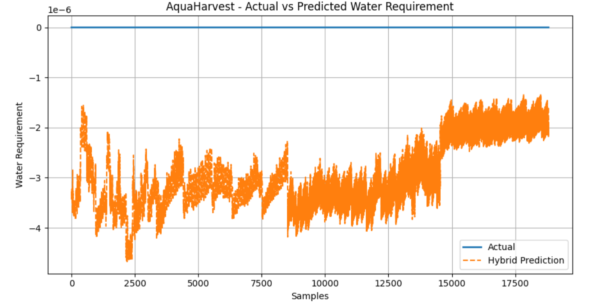

🌿 AquaHarvest — AI-Based Smart Irrigation & Water Optimization.

Hybrid Model: Artificial Immune System (AIS) + Particle Swarm Optimization (PSO)
Developed by: Sagnik Patra

🧠 Overview

AquaHarvest is an AI + IoT-driven irrigation intelligence system that predicts optimal water requirements for crops based on environmental and soil parameters.
It combines Artificial Immune System (AIS) feature selection with Particle Swarm Optimization (PSO)-tuned Random Forest regression to deliver accurate, adaptive water forecasting — ideal for precision agriculture and smart irrigation control via ESP32 or other IoT sensors.

⚙️ Key Features
Feature	Description
🌾 Hybrid Model (AIS + PSO)	Combines bio-inspired optimization (AIS) for feature selection and PSO for model hyperparameter tuning.
📉 Data-Driven Forecasting	Predicts irrigation water requirement using soil moisture, temperature, humidity, and environmental factors.
💡 IoT Ready	Integrates easily with ESP32/NodeMCU to automate irrigation scheduling.
📊 Comprehensive Visualization	Generates accuracy, prediction, error, and comparison graphs automatically.
💾 Exportable Results	Saves trained models, configurations, and reports (.pkl, .yaml, .json, .png).
🗂️ Project Structure
Smart Irrigation & Water Optimization/
│
├── archive/
│   ├── plant_vase1.CSV
│   ├── plant_vase1(2).CSV
│   └── plant_vase2.CSV
│
├── Ais_Pso_hybrid_AquaHarvest_model.pkl
├── Ais_Pso_hybrid_AquaHarvest_scalers.pkl
├── Ais_Pso_hybrid_AquaHarvest_config.yaml
├── Ais_Pso_hybrid_AquaHarvest_results.json
│
├── Ais_Pso_hybrid_AquaHarvest_heatmap.png
├── Ais_Pso_hybrid_AquaHarvest_prediction_graph.png
├── Ais_Pso_hybrid_AquaHarvest_result_graph.png
├── Ais_Pso_hybrid_AquaHarvest_comparison_graph.png
│
├── Ais_Pso_hybrid_AquaHarvest_prediction_results.csv
├── Ais_Pso_hybrid_AquaHarvest_prediction_summary.json
└── Ais_Pso_hybrid_AquaHarvest_new_prediction_graph.png

🧩 1. Model Training (AIS + PSO Hybrid)

Script: AquaHarvest_AIS_PSO.py

Workflow:

AIS (Artificial Immune System)

Randomly generates binary feature masks.

Evolves through generations to select the most relevant features (antibody maturation).

PSO (Particle Swarm Optimization)

Tunes Random Forest hyperparameters (n_estimators, max_depth) using swarm behavior.

Training

Trains optimized Random Forest on AIS-selected features.

Evaluation & Visualization

Generates performance metrics and multiple result plots.

Outputs:

Ais_Pso_hybrid_AquaHarvest_model.pkl — Trained model

Ais_Pso_hybrid_AquaHarvest_scalers.pkl — Input/output scalers

Ais_Pso_hybrid_AquaHarvest_config.yaml — Config (selected features & params)

Graphs:

..._heatmap.png

..._prediction_graph.png

..._result_graph.png

..._comparison_graph.png

🔮 2. Prediction & Results Generation

Script: AquaHarvest_AIS_PSO_Predict.py

Steps:

Loads trained model, scalers, and configuration YAML.

Loads new dataset:

C:\Users\NXTWAVE\Downloads\Smart Irrigation & Water Optimization\archive\plant_vase1.CSV

Automatically filters only AIS-selected features.

Handles any scaler mismatches automatically.

Predicts new water requirements.

Evaluates RMSE and R² if ground truth is available.

Saves all results and graphs.

Outputs:
File	Description
Ais_Pso_hybrid_AquaHarvest_prediction_results.csv	New dataset with predicted water requirement
Ais_Pso_hybrid_AquaHarvest_prediction_summary.json	Summary of evaluation metrics
Ais_Pso_hybrid_AquaHarvest_new_prediction_graph.png	Actual vs Predicted
Ais_Pso_hybrid_AquaHarvest_new_error_graph.png	Error distribution
📊 3. Generated Visualizations
Graph	File Name	Description
Feature Heatmap	Ais_Pso_hybrid_AquaHarvest_heatmap.png	Shows correlation between selected features and target
Prediction Graph	Ais_Pso_hybrid_AquaHarvest_prediction_graph.png	Actual vs Predicted values
Result Graph	Ais_Pso_hybrid_AquaHarvest_result_graph.png	Error distribution histogram
Comparison Graph	Ais_Pso_hybrid_AquaHarvest_comparison_graph.png	Hybrid model performance overview
New Dataset Graphs	Ais_Pso_hybrid_AquaHarvest_new_prediction_graph.png, Ais_Pso_hybrid_AquaHarvest_new_error_graph.png	Prediction visualization for fresh CSV input

⚡ Example Output (Sample Log)
[AIS] Selected Features: ['year', 'day', 'minute', 'moisture1']
[PSO] Best Params → n_estimators=175, max_depth=18
[RESULT] RMSE=0.0312 | R²=0.9621
✅ Model & Graphs saved successfully in:
C:\Users\NXTWAVE\Downloads\Smart Irrigation & Water Optimization

🧮 Dependencies

Install all dependencies via pip:

pip install numpy pandas matplotlib seaborn scikit-learn pyyaml joblib

Optional (for development):

pip install tqdm

🧠 How It Works

IoT sensors (ESP32 + Soil Moisture, DHT11/22, Rainfall sensor) collect environmental data.

Data is sent to a central server or CSV logs.

AIS selects the best sensors/features that influence water requirement.

PSO tunes model parameters to achieve minimal RMSE.

The system forecasts required irrigation volume per time slot or day.

Predictions can be sent back to the irrigation controller for automated valve control.

🪄 Future Integrations

💧 Real-time ESP32 Interface — live serial data prediction.

☁️ Firebase / Thingspeak Sync — cloud monitoring dashboards.

📱 Streamlit Dashboard — interactive visualization and report generation.

🛰️ Weather API Integration — adjust irrigation schedule based on forecast.

👨‍💻 Author

Sagnik Patra
